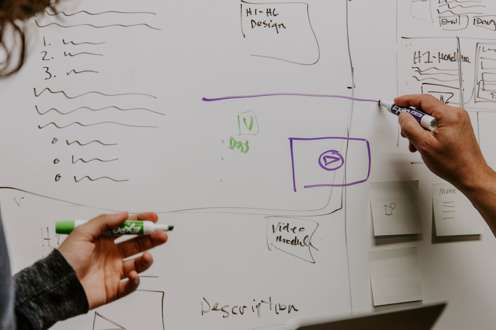
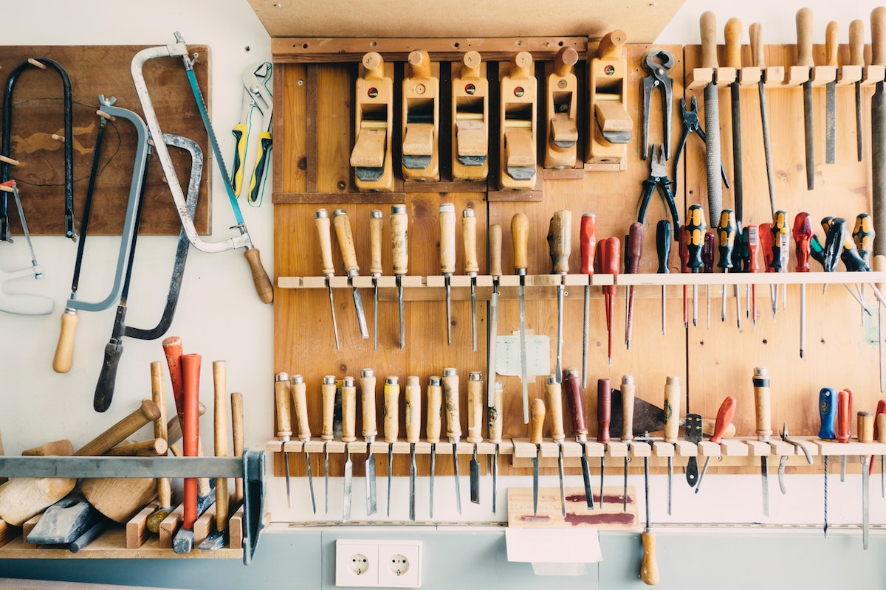
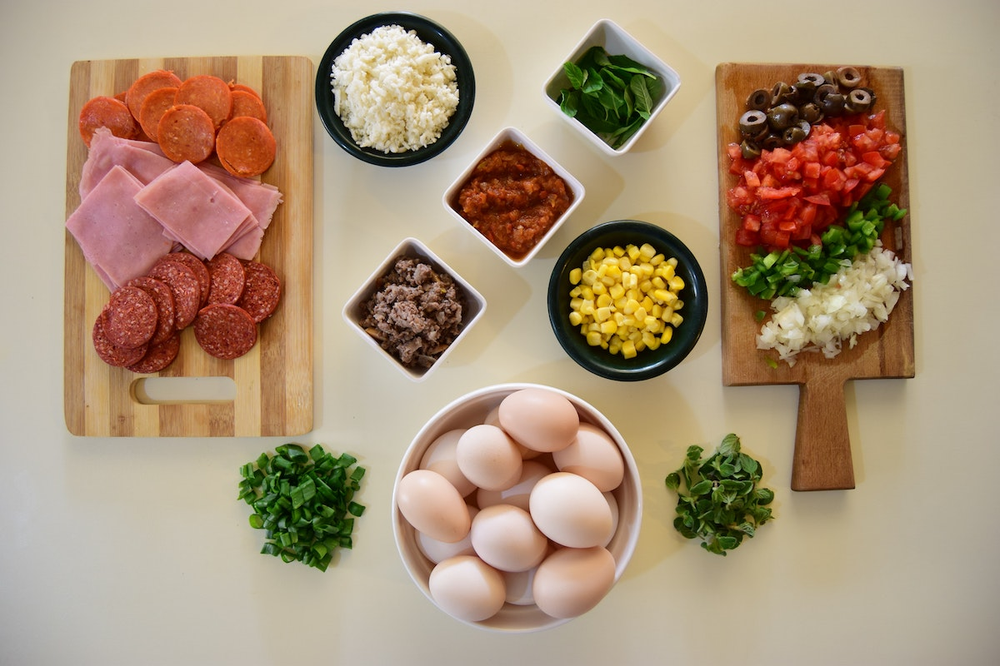
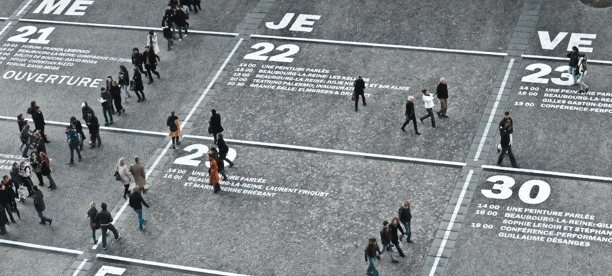
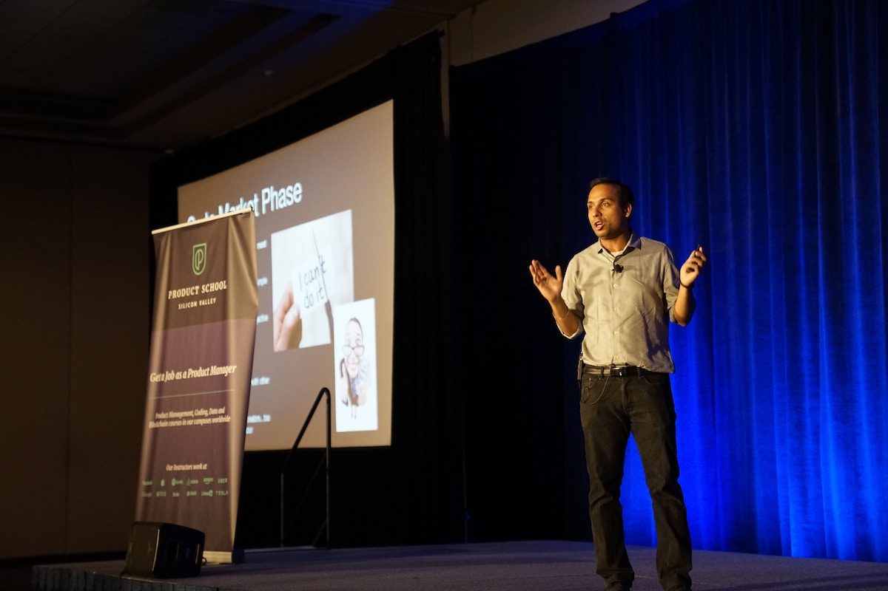

```{r setup, include=FALSE}
usethis::use_git_ignore(c("*.csv", "*.rds"))
options(htmltools.dir.version = FALSE)

library(knitr)
library(tidyverse)
library(xaringan)
library(fontawesome)
```

class: inverse, center, middle

# `r fa("fas fa-images", fill = "#fff")`

**View the slides:** 

[bretsw.com/eme6665-fs24-module5](https://bretsw.com/eme6665-fs24-module5)

---

class: inverse, center, middle

# `r fa("comments", fill = "#fff")` <br><br> Module 4 <br> Recap

---

# `r fa("comments", fill = "#fff")` Craft an Argument

```{r, out.width = "600px", echo = FALSE, fig.align = "center"}

```

--

Your lit review should provide evidence to answer:

--

- Why is your study necessary?

--

- How should you go about your investigation?

---

# `r fa("comments", fill = "#fff")` IFF

```{r, out.width = "600px", echo = FALSE, fig.align = "center"}
include_graphics("img/necessary-sufficient.jpg")
```

Your lit review should include only what *must* be there:

--

- "If-and-Only-If: Necessary and sufficient"

--

- What are the "load-bearing" walls in your lit review?

---

class: inverse, center, middle

# `r fa("fas fa-down-left-and-up-right-to-center", fill = "#fff")` <br><br> Module 5:<br>Synthesis Over Summary

---

class: inverse, center, middle

# `r fa("fas fa-down-left-and-up-right-to-center", fill = "#fff")` Synthesis:

<div class="definition">
<p>
the composition or combination of parts or elements so as to form a whole
</p>
</div>
<br>
<div class="caption">
<p>
Source: <a href="https://www.merriam-webster.com/dictionary/synthesis" target="_blank">Merriam-Webster Dictionary</a>
</p>
</div>

---

class: inverse, center, middle

# `r fa("fas fa-down-left-and-up-right-to-center", fill = "#fff")` Synthesis:

<div class="definition">
<p>
the dialectic combination of thesis and antithesis into a higher stage of truth
</p>
</div>
<br>
<div class="caption">
<p>
Source: <a href="https://www.merriam-webster.com/dictionary/synthesis" target="_blank">Merriam-Webster Dictionary</a>
</p>
</div>

---

class: inverse, center, middle

# `r fa("fas fa-down-left-and-up-right-to-center", fill = "#fff")` Synthesis:

<div class="definition">
<p>
the combining of often diverse conceptions into a coherent whole
</p>
</div>
<br>
<div class="caption">
<p>
Source: <a href="https://www.merriam-webster.com/dictionary/synthesis" target="_blank">Merriam-Webster Dictionary</a>
</p>
</div>

---

# `r fa("fas fa-down-left-and-up-right-to-center", fill = "#fff")` Module 5 Readings

```{r, out.width = "540px", echo = FALSE, fig.align = "center"}

```

### Galvan & Galvan, 2017, Chapter 9
*Synthesizing Trends and Patterns: Preparing to Write*

<hr>

--

**✓ Guideline 1:** Consider Your Purpose and Voice before Beginning to Write

---

# `r fa("fas fa-down-left-and-up-right-to-center", fill = "#fff")` Module 5 Readings

```{r, out.width = "540px", echo = FALSE, fig.align = "center"}

```

### Galvan & Galvan, 2017, Chapter 9
*Synthesizing Trends and Patterns: Preparing to Write*

<hr>

**✓ Guideline 3:** Create a Topic Outline That Traces Your Argument

---

# `r fa("fas fa-down-left-and-up-right-to-center", fill = "#fff")` Module 5 Readings

```{r, out.width = "540px", echo = FALSE, fig.align = "center"}

```

### Galvan & Galvan, 2017, Chapter 9
*Synthesizing Trends and Patterns: Preparing to Write*

<hr>

**✓ Guideline 4:** Reorganize Your Notes According to the Path of Your Argument

---

# `r fa("fas fa-down-left-and-up-right-to-center", fill = "#fff")` Module 5 Readings

```{r, out.width = "540px", echo = FALSE, fig.align = "center"}

```

### Galvan & Galvan, 2017, Chapter 9
*Synthesizing Trends and Patterns: Preparing to Write*

<hr>

**✓ Guideline 5:** Within Each Topic Heading, Note Differences among Studies

---

# `r fa("fas fa-down-left-and-up-right-to-center", fill = "#fff")` Module 5 Readings

```{r, out.width = "540px", echo = FALSE, fig.align = "center"}

```

### Galvan & Galvan, 2017, Chapter 9
*Synthesizing Trends and Patterns: Preparing to Write*

<hr>

**✓ Guideline 6:** Within Each Topic Heading, Look for Obvious Gaps or Areas
Needing Additional Research

---

# `r fa("fas fa-down-left-and-up-right-to-center", fill = "#fff")` Module 5 Readings

```{r, out.width = "540px", echo = FALSE, fig.align = "center"}

```

### Galvan & Galvan, 2017, Chapter 9
*Synthesizing Trends and Patterns: Preparing to Write*

<hr>

**✓ Guideline 10:** Plan to Present Conclusions and Implications

---

class: inverse, center, middle

# `r fa("fas fa-binoculars", fill = "#fff")` <br><br> Looking ahead

---

# `r fa("fas fa-calendar-day", fill = "#fff")` Semester schedule

```{r, out.width = "480px", echo = FALSE, fig.align = "center"}

```

- Module 1: Threads of Chapter One

- Module 2: Do You Trust Me?

- Module 3: A Handbook's Tale

- Module 4: Systematic Not Automatic

- **Module 5: Synthesis Over Summary**

- Module 6: Elements of Style (for Academic Writing)

- Module 7: Weaving Together Chapter One

---

# `r fa("fas fa-file-pen", fill = "#fff")` One Completed Subsection

--

**Assignment Objective:** Write a complete, if initial, draft of **one subsection** of your lit review that will appear in your dissertation prospectus. This is meant to be a specific, practical step toward writing your full prospectus.

--

<hr>

1. Come up with a rough draft of a **Topic Outline** for your lit review (optional).

--

2. Pick one **major theme**.

--

3. **Synthesize** studies related to this theme: Combine often diverse conceptions into a **coherent whole**
  
--

4. **Explain the significance** of these studies

--

5. **Craft an argument**: Be clear with the point you are trying to make with this section.

--

<hr>

### Once again (again), your main objective is **synthesis**!

---

# `r fa("fas fa-file-pen", fill = "#fff")` Start with a Topic Outline

```{r, out.width = "480px", echo = FALSE, fig.align = "center"}

```

--

- Pick one major theme

--

- List 5-10 points you want to make 

--

- Write a topic sentence for each of these 5-10 points

--

- Underneath each topic sentence, start to organize references that provide evidence supporting the point

---

# `r fa("fas fa-file-pen", fill = "#fff")` Join Ongoing Conversations

```{r, out.width = "480px", echo = FALSE, fig.align = "center"}

```

--

Your lit review is like a **cocktail party**:

--

- There are already people talking in the literature

--

- You're study is you joining in

--

- The lit review shows that you're listening before speaking

---

# `r fa("fas fa-file-pen", fill = "#fff")` Articles Talking to Each Other

```{r, out.width = "480px", echo = FALSE, fig.align = "center"}

```

--

- Synthesis means showing how past research speaks to each other

--

- Following a topic sentence, cite multiple sources that support that point

--

- Rule of thumb: **Avoid citing only one study in a paragraph**

---

class: inverse, center, middle

# `r fa("fas fa-question", fill = "#fff")` <br><br> Questions

<hr>

**What questions can I answer for you now?**

**How can I support you this week?**

<hr>

`r fa("envelope", fill = "#fff")` [bret.staudtwillet@fsu.edu](mailto:bret.staudtwillet@fsu.edu) | `r fa("globe", fill = "#fff")` [bretsw.com](https://bretsw.com) | `r fa("fab fa-github", fill = "#fff")` [GitHub](https://github.com/bretsw/)
